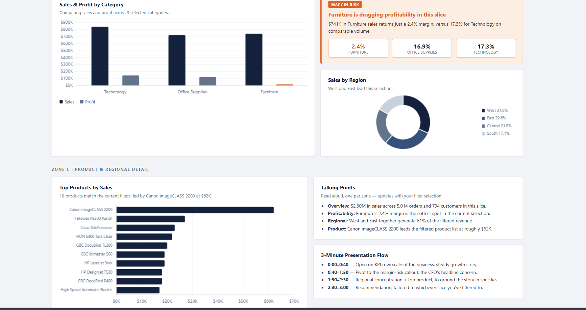
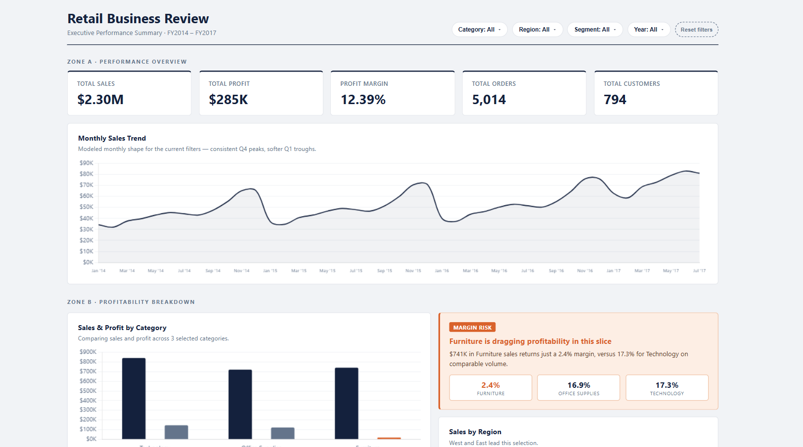
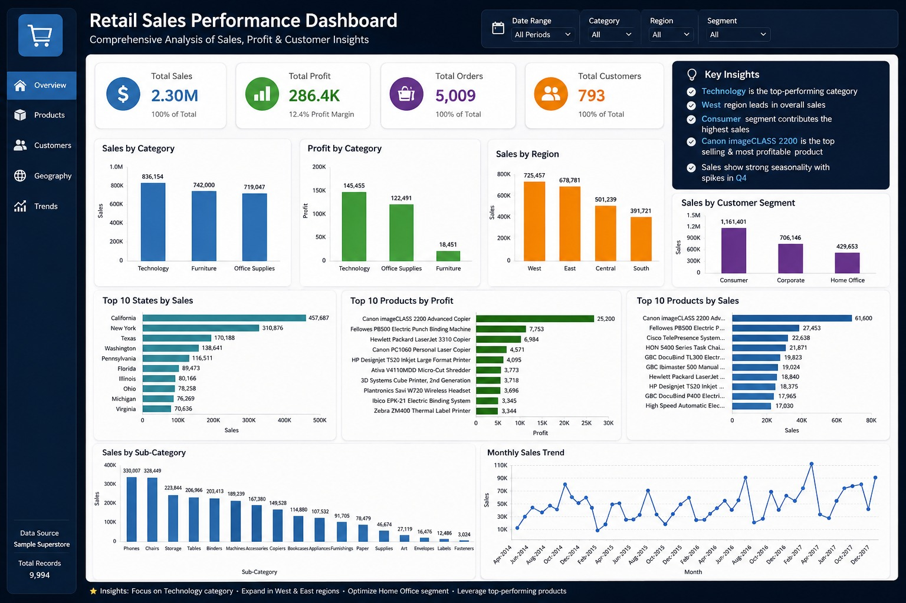

# 📊 Retail Sales Performance & Profitability Analysis

## 📌 Project Overview

This project analyzes retail sales performance, profitability, customer behavior, regional trends, and product performance using SQL and Power BI.

The objective is to transform raw sales data into actionable business insights that can help decision-makers improve revenue, profitability, and operational efficiency.

---

## 🎯 Business Objectives

- Identify top-performing products and categories
- Analyze sales and profit trends over time
- Evaluate regional performance
- Measure customer purchasing behavior
- Discover profitability drivers
- Create an interactive executive dashboard

---

## 🛠️ Tools & Technologies

- MySQL 8.0
- Power BI
- SQL Window Functions
- DAX
- Data Modeling
- Data Visualization

---

## 📂 Dataset

Dataset Used: Superstore Sales Dataset

Features Included:

- Orders
- Customers
- Products
- Categories
- Regions
- Sales
- Profit
- Quantity
- Discount
- Shipping Information

---

## 📈 Key Performance Indicators (KPIs)

| KPI | Value |
|------|--------|
| Total Sales | $2.30M |
| Total Profit | $285K |
| Profit Margin | 12.39% |
| Total Orders | 5,014 |
| Total Customers | 794 |

---

## ❓ Business Questions Solved

### Sales Analysis

- Total Revenue Generated
- Monthly Sales Trend
- Quarterly Sales Analysis
- Yearly Sales Performance
- Top Revenue Generating Categories

### Profitability Analysis

- Total Profit Generated
- Profit Margin Analysis
- Most Profitable Categories
- Least Profitable Categories

### Customer Analysis

- Top Customers by Sales
- Customer Purchase Behavior
- Segment Performance Analysis

### Product Analysis

- Top Products by Sales
- Top Products by Profit
- Product Performance Ranking

### Regional Analysis

- Regional Sales Performance
- Regional Profitability Analysis
- Revenue Contribution by Region

### Advanced SQL Analysis

- Running Totals
- Window Functions
- ROW_NUMBER()
- RANK()
- DENSE_RANK()
- Common Table Expressions (CTEs)

---

## 🧠 SQL Concepts Used

- Aggregate Functions
- GROUP BY
- ORDER BY
- CASE Statements
- Subqueries
- Common Table Expressions (CTEs)
- Window Functions
- ROW_NUMBER()
- RANK()
- DENSE_RANK()
- Running Totals
- Date Functions

---

## 📊 Dashboard Features

### Executive KPI Section

- Total Sales
- Total Profit
- Profit Margin
- Total Orders
- Total Customers

### Interactive Filters

- Category
- Region
- Segment
- Year

### Visualizations

- Monthly Sales Trend
- Sales vs Profit by Category
- Regional Sales Distribution
- Top Products Analysis
- Business Insights Section

## 📸 Dashboard Preview

### Executive Dashboard

### Detailed Dashboard

### Python EDA Dashboard

---

## 🔍 Key Insights

### Revenue

- Total sales exceeded $2.3 million.
- Technology category generated the highest revenue.

### Profitability

- Furniture showed the lowest profit margin.
- Technology generated the highest profit contribution.

### Regional Performance

- West and East regions contributed the majority of revenue.
- Regional concentration indicates growth opportunities.

### Product Performance

- Canon imageCLASS 2200 emerged as the top-selling product.
- Several products generated high revenue with strong margins.

---

## 🚀 Project Outcome

This project demonstrates how SQL and Power BI can be combined to transform transactional sales data into meaningful business intelligence.

The analysis supports data-driven decision making by highlighting trends, opportunities, and profitability drivers across products, customers, and regions.

---

## 👤 Author

Prince

Aspiring Data Analyst | SQL | Power BI | Python | Excel
